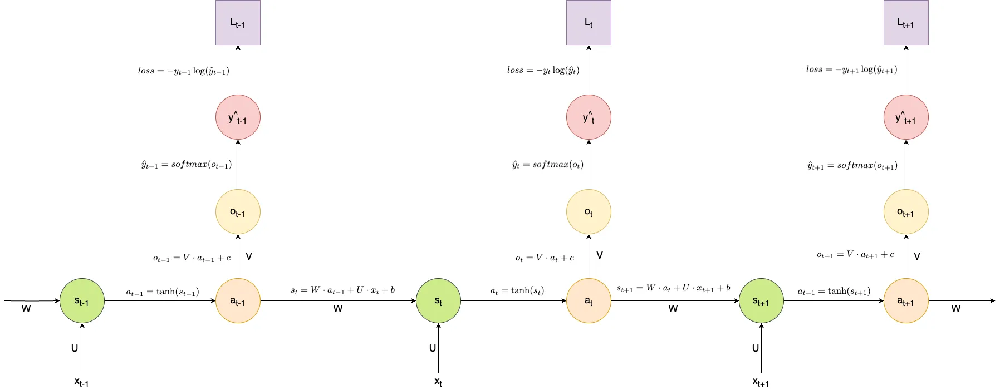

**Variables and their role**
$W$ - recurrent weight matrix connecting hidden states
$U$ - input weight matrix connecting input to hidden states
$V$ - output weight matrix connecting hidden states to output
$s$ - weighted sum of the previous hidden state and current input
$a$ - hidden state activation value
$o$ - weighted output of activation
$\hat{y}$ - predicted value/normalized probabilities
$y$ - target value
$L$ - loss value
$t$ - time step
$b$ - bias matrix for hidden states
$c$ - bias matrix for output

- At each time step, we calculate the weighted sum of the current input $x_t$ and the previous hidden state's activation value $a_{t-1}$
  - This sum is $s_t$
  - $s_t$ is then passed through the non-linearity activation function $\tanh$ so that the model can learn about the non-linear relationships present in the input
  - $W$ and $U$ are weight matrices that jointly transform the previous state and current input within the weighted sum
  - $b$ provides a bias offset
- Once the activation value $a_t$ is calculated for this time step, the output is equal to the weighted activation (with weights $V$) and bias $c$
- The softmax function is then applied to the unnormalized output value (logits) to create $\hat{y}$
- In total, the process is described below:
$$s_t = W \cdot a_{t-1} + U \cdot x_t + b$$
$$a_t = \tanh(s_t)$$
$$o_t = V \cdot a_t + c$$
$$\hat{y}_t=\rm{softmax}(o_t)$$

- For the initial time step $t=0$, the activation matrix $a_{t-1}$ should be initialized to the all-zero matrix to avoid any potential errors
- In this instance, the inputs are discrete characters which are converted into one-hot encoded vectors before they are fed into the model which produces a predicted output
  - One-hot encoding is a way to express discrete elements numerically (i.e. words or characters)
  - It can be thought of as a probabilistic distribution where the mass is around a single value
  - It is one of many ways to encode our data
  - For example, with the English alphabet, we encode 'A' into $[1,0,\dots,0]$, 'B' into $[0,1,\dots,0]$, etc.
- $\tanh$ is a popular choice for an activation function in an RNN, so we use it
- When training the parameters of the RNN, a loss function is needed to measure how well the predicted character probabilities match the true sequence
  - A common choice when working with categorical distributions is cross-entropy loss, which computes the difference between the predicted values and true target values
  - At each time step, we can calculate the loss and sum the overall loss at the end:
$$L=\sum_{t=1}^T L_t$$ where
$$L_t=\rm{loss}(\hat{y}_t,y_t)=-y_t\log(\hat{y}_t)$$
- By comparing predicted and actual character distributions at different sequence positions, cross-entropy loss provides a gradient signal to update parameters towards more desired outputs - the objective is to minimize this function to increase prediction accuracy

**Backpropagation through time**
- For an unrolled computational graph of an RNN, we calculate the gradients in a backward pass layer by layer from the last time step towards the initial time step
- We use this to update the shared weights and baises, and minimize loss by "nudging" parameters for each time step to impact the loss negatively
- Since the parameters are not directly contributing to the loss function, but are in a multiple nested function, we need to use the chain rule and product rule to calculate derivatives and calculate our gradients

Starting with the loss function, we have
$$L_t=\rm{loss}=-y_t\log(\hat{y}_t)$$
which has derivative
$$\frac{\partial L_t}{\partial\hat{y}_t}=-\frac{y_t}{\hat{y}_t}$$

We then move down the derivative of loss with respect to the weighted output, and use the derivative of the softmax formula to get
$$\frac{\partial L_t}{\partial o_t}=\frac{\partial L_t}{\partial\hat{y}_t}\frac{\partial\hat{y}_t}{\partial o_t}=-\frac{y_t}{\hat{y}_t}\cdot \frac{\partial \rm{softmax}}{\partial o_t}=\hat{y}_t-y_t$$

**Gradient calculations**
- With the gradient of the weighted output, we can calculate the gradient of the output bias $c$ using the chain rule
- Skipping the chain rule derivation, we get
$$\frac{\partial L_t}{\partial c}=\hat{y}_t-y_t$$
- The weight matrix $V$ can also be found using the chain rule:
$$\frac{\partial L_t}{\partial V}=(\hat{y}_t-y_t)\cdot a_t$$

- To calculate the gradients of $U$, $W$, and $b$, we need to compute some intermediate values, such as the gradient of the current activaton wrt current output and the next time step's loss:
$$\frac{\partial L_t}{\partial a_t}=(\hat{y}_t-y_t)\cdot V + (\frac{\partial L_{t+1}}{\partial s_{t+1}})\cdot W$$
where the gradient of the weighted sum is
$$\frac{\partial L_t}{\partial s_t}=[1-\tanh(s_t)^2]\cdot \frac{\partial L_t}{\partial a_t}$$
- This allows us to find the gradients of $W$, $U$, and $b$:
$$\frac{\partial L_t}{\partial W}=\frac{\partial L_t}{\partial a_t}\cdot a_{t-1}$$
$$\frac{\partial L_t}{\partial U}=\frac{\partial L_t}{\partial s_t}\cdot x_t$$
$$\frac{\partial L_t}{\partial b}=\frac{\partial L_t}{\partial s_t}$$
- Finally, the gradient of the current step's loss wrt previous activation is
$$\frac{\partial L_t}{\partial a_t}=\frac{\partial L_t}{\partial s_t}\cdot W$$

- This allows us to write all of our parameters based on the gradients of the current time step $t$:
$$V=V-\alpha\cdot \frac{\partial L_t}{\partial V}$$
$$c=c-\alpha \cdot \frac{\partial L_t}{\partial c}$$
$$U=U-\alpha \cdot \frac{\partial L_t}{\partial U}$$
$$W=W-\alpha \cdot \frac{\partial L_t}{\partial W}$$
$$b=b-\alpha \cdot \frac{\partial L_t}{\partial b}$$

- One thing to note is that we may run into a problem with our gradient vanishing/exploding
  - A vanishing gradient could lead to loss of dependency information
  - An exploding gradient could make the optimization unstable with the loss function bouncing back and forth away from the global minima
- To deal with this, we can reduce the learning rate, reduce the number of hidden layers, or perform a technique known as gradient clipping
  - Gradient clipping is one of the most popular approaches with high accuracy and low effort to implement